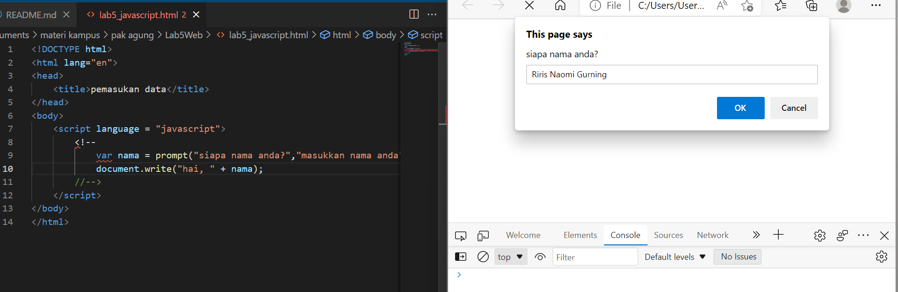

# Praktikum 5: Javascript

<strong>Repository ini dibuat untuk memenuhi tugas Pemrograman Web</strong>
| <strong>Nama</strong>      | <strong>Riris Naomi Gurning</strong>  |
| ----------- | ----------- |
| <strong>NIM</strong>     | <strong>312010190</strong>       |
| <strong>Kelas</strong>   | <strong>TI.20.A.1</strong>        |

# Langkah-langkah Praktikum 5 "Javascript"

1. Pertama - tama membuka VSCode
 

2. Kemudian membuat dokumen HTML dengan nama <b><i>file lab4_box.html</i></b> beserta masukan kode berikut:
 
Ini hasil dari kode tersebut

 

3. <b>Javascrip Dasar</b> Pemakaian Alert sebagai property window. Masukkanlah kode berikut: 

Pemakaian method dalam objek. Masukkanlah kode berikut:

Pemakaian Prompt. Masukkanlah kode berikut:

Pembuatan fungsi dan cara pemanggilannya. Masukkanlah kode berikut:

4. <b>Dasar Pemrograman Di Javascript</b> Operasi dasar aritmatika 

Seleksi kondisi (if..else)

Penggunaan operator switch untuk seleksi kondisi

Ini hasil dari kode tersebut

Saya membuat angka 5, lalu saya klik ok

Ini hasilnya

5. <b>Pembuatan Form</b> Form Input 
 Form Button 

Ini hasil dari kode tersebut

Lalu saya klik latar belakang hijau dan teks kuning, inilah hasilnya

6. <b>HTML DOM</b> Pilihan menggunakan checkBox dengan perhitungan otomatis 

ini hasil dari kode tersebut dan saya klik ayam goreng dan tahu goreng, akan muncul jumlahnya secara otomatis

# Pertanyaan dan Tugas
1. Buat script untuk melakukan validasi pada isian form.

# Dibawah ini terdapat script dan hasilnya dari pertanyaan tersebut

1. Pertama tama saya membuat file dengan nama <b>form.html</b>

2. Disini kita memerintahkan untuk menjalankan function validasi() saat form di submit.onSubmit="validasi()". 
 yang mana function validasi sudah kita buat untuk mengecek inputan. 

kita menangkap nilai value dari form input dan memasukkannya kedalam variabel.

dan kemudian mengecek masing - masing variabel.

Inilah hasil dari kode tersebut: 

saya akan isi semua formnya, jika nama, email, alamat dan prodi diisi atau tidak kosong, maka akan dikembalikan nilai True pada form agar dapat di teruskan

jika nama, email, alamat dan prodi kosong maka tampilan akan seperti ini:

