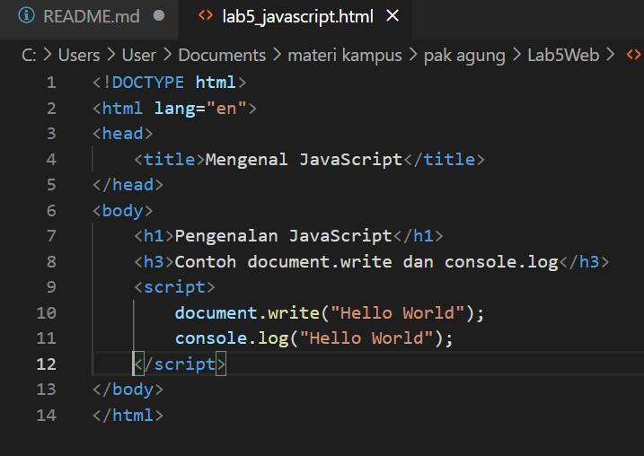
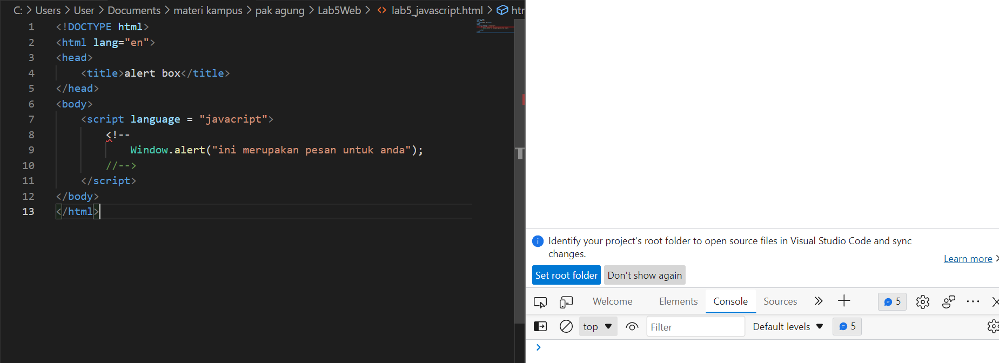

# Praktikum 5: Javascript

<strong>Repository ini dibuat untuk memenuhi tugas Pemrograman Web</strong>
| <strong>Nama</strong>      | <strong>Riris Naomi Gurning</strong>  |
| ----------- | ----------- |
| <strong>NIM</strong>     | <strong>312010190</strong>       |
| <strong>Kelas</strong>   | <strong>TI.20.A.1</strong>        |

# Langkah-langkah Praktikum 5 "Javascript"

1. Pertama - tama membuka VSCode
 

2. Kemudian membuat dokumen HTML dengan nama <b><i>file lab4_box.html</i></b> beserta masukan kode berikut:
 
Ini hasil dari kode tersebut

 

3. <b>Javascrip Dasar</b> Pemakaian Alert sebagai property window. Masukkanlah kode berikut: 

Pemakaian method dalam objek. Masukkanlah kode berikut:

Pemakaian Prompt. Masukkanlah kode berikut:

Pembuatan fungsi dan cara pemanggilannya. Masukkanlah kode berikut:

4. <b>Dasar Pemrograman Di Javascript</b> Operasi dasar aritmatika 

Seleksi kondisi (if..else)

